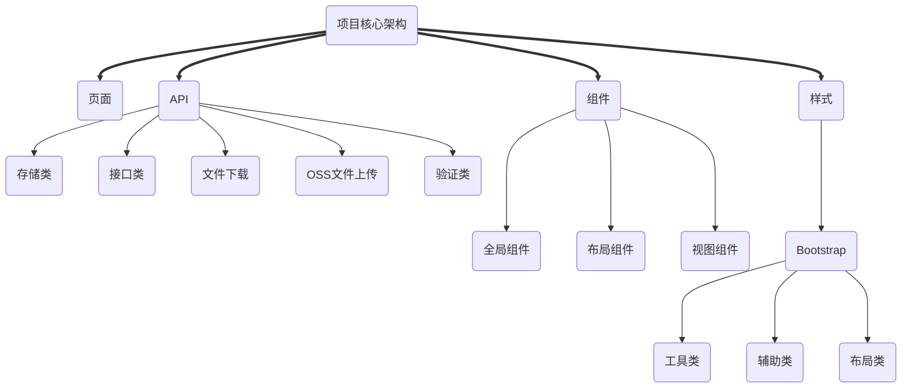

# vue前端项目文档

?> 写这份文档的初衷是为了让团队成员以一种友好的方式了解自己的项目架构，快速上手干起来

> 文档作者：`shaonianzhentan`   联系方式：`QQ: 635147515`

```mermaid
graph
  project(项目核心架构)==>views(页面)
  project==>components(组件)
    components--->global(全局组件)
    components--->layout(布局组件)
    components--->other(视图组件)
  project==>styles(样式)
    styles--->Bootstrap(Bootstrap)
      Bootstrap--->utilities(工具类)
      Bootstrap--->helpers(辅助类)
      Bootstrap--->layouts(布局类)
  project==>api(API)
    api-->storage(存储类)
    api-->service(接口类)
    api-->download(文件下载)
    api-->oss(OSS文件上传)
    api-->validate(验证类)
```